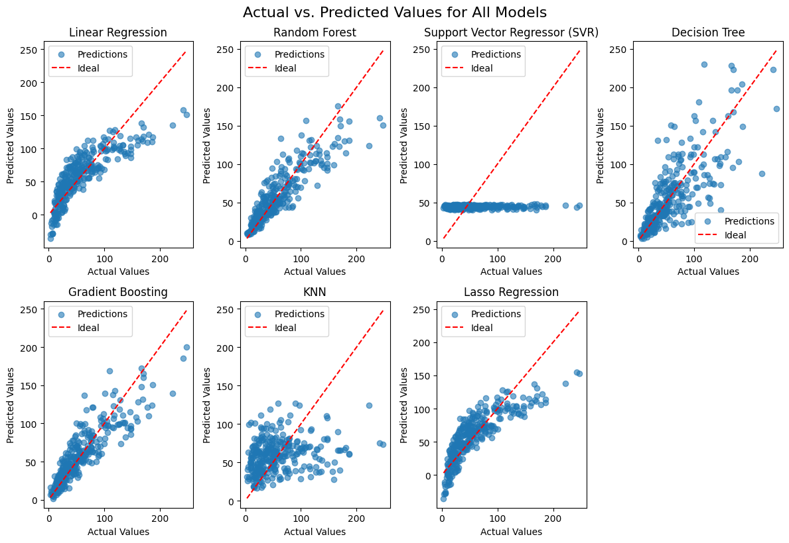

# Fuel Cell Performance Prediction

This project analyzes the performance of various prediction models for fuel cell data. The primary goal is to predict `Target5` based on the provided features, compare different regression models, and identify the best-performing model based on R² scores.

## Dataset
- The dataset contains multiple targets (`Target1` to `Target5`) and associated features.
- Only `Target5` was selected for prediction. Other targets were dropped.

## Models Evaluated
The following regression models were used for the analysis:
- Linear Regression
- Random Forest
- Support Vector Regressor (SVR)
- Decision Tree
- Gradient Boosting
- K-Nearest Neighbors (KNN)
- Lasso Regression

## Workflow
1. Load the dataset.
2. Select `Target5` as the prediction target.
3. Split the dataset into training (70%) and testing (30%) sets.
4. Train the above models.
5. Evaluate the models using the R² metric.
6. Visualize predictions and residuals.

## Model Performance
The table below summarizes the R² scores for each model:

| Model                  | R² Score |
|------------------------|-----------|
| Linear Regression      | 0.8423    |
| Random Forest          | 0.9127    |
| Support Vector Regressor (SVR) | 0.7641    |
| Decision Tree          | 0.8895    |
| Gradient Boosting      | 0.9201    |
| KNN                    | 0.7863    |
| Lasso Regression       | 0.8415    |

**Best Model:** Gradient Boosting with an R² score of 0.9201.

## Visualizations
### 1. Scatter Plots: Actual vs Predicted Values
The scatter plots below compare actual vs. predicted values for each model. The red dashed line represents the ideal predictions.

### 2. Residuals Distribution for the Best Model
The residuals plot for the best model (Gradient Boosting) shows the distribution of prediction errors.

## Conclusion
The Gradient Boosting model performed the best with an R² score of 0.9201, indicating high accuracy in predicting `Target5`. Further optimization and feature engineering can potentially improve model performance.
